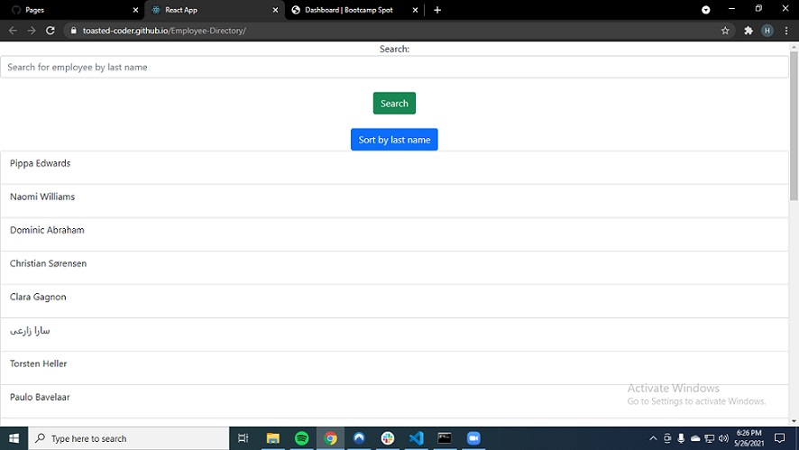

# Employee-Directory

## Table of Contents

- [Description](#description)
- [Installation](#installation)
- [Usage](#usage)
- [Contributors](#contributors)
- [Testing](#testing)
- [Questions](#questions)
- [License](#license)

## Screenshots

## Description

Search tool for finding employees based off their last names. Search results can also be sorted alphabetically.

## Installation

Clone the repo and run npm i in your project directory.

## Usage

N/A

## Contributors

Myself, and my teacher Alex for helping me get the project properly deployed to github pages.

## Testing

N/A

## Questions

Email address: christmanholmes21@gmail.com
GitHub username: [toasted-coder](https://github.com/toasted-coder)

## License

